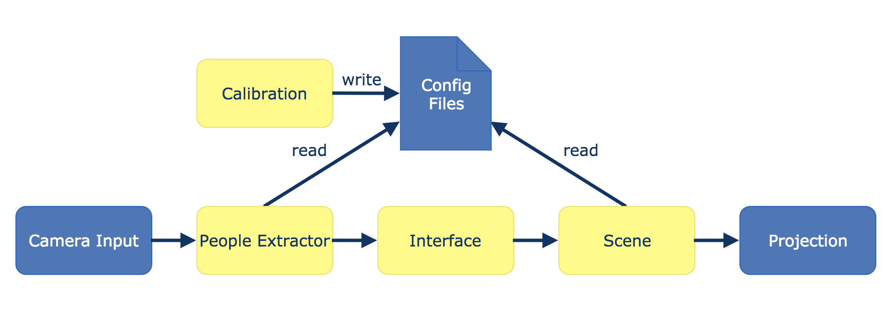

# IMOVE - A Track and Project Framework

This Repository contains the source code and documentation of the IMOVE project. This project is a framework that combines image processing, calibration techniques and computer graphics to create an interactive experience for the user, using a projector and a camera.

License: MIT

Project trailer: https://surfdrive.surf.nl/files/index.php/s/6vKv83chKxZsPUh

## Building the project
The project is built using CMake with gcc/g++. The easiest way to build it is to run the build script from terminal (./build.sh from repository root).

### Dependencies
To build this project you will need to have 3 libraries installed on your system: OpenCV 3.4.1, SFML 2.4.2, boost 1.66.0. The project should be able to find the libraries automatically.

## Components
The following components are built:

### calibration
This is a separate component used to calibrate the program to configure certain setup-specific variables, such as the location of the projection in the camera view.

From cli (run from repository root):
```
$ ./build/bin/calibration ./config/<yourconfigfile>.yml <camera id> <projector resolution width> <projector resolution height>
```
or put the desired settings in the calibrate script and run
```
$ ./calibrate.sh
```

### imove
This is the main component. It processes the camera input and turns it into the graphics that are to be projected by the projector. When running imove, it automatically splits itself into two components that run separately, imove_peopleextractor which handles detection and imove_scene which handles the graphics being projected.

From cli (run from repository root):
```
$ ./build/bin/imove ./config/<system config file>.yml ./config/<scene config file>.yml
```
or put the desired settings in the run script and run
```
$ ./run.sh
```


## Parts of the IMOVE framework
IMOVE consists of a number of interacting parts. The diagram below shows the high-level structure of the project.




###### Calibration
The calibration part writes all settings modified during calibration to configuration files.

###### People Extractor
This part is responsible for detecting and identifying people in the scene. It reads out values from the config files to adapt to the situation, for example the height of the camera.

###### Interface
The people extractor and scene each run on their own threads which means that an interface is needed for them to be able to communicate. That is what the interface entities are responsible for, communicating the people extractor's results to the scene across threads. It also provides a mapping functionality of locations from camera frame to projection scene.

###### Scene
The scene generates graphics based on the received locations which is what gets projected for the users to see and what they can interact with.

## Applications
There are 3 applications in this repository that were built with the IMOVE framework: the light trails application, which can be found in the lighttrails branch, the pong application in the pong branch and a simple example scene in the main branch. Another application can be found in this repository:
https://github.com/maximliefaard/SaveTheTurtles
